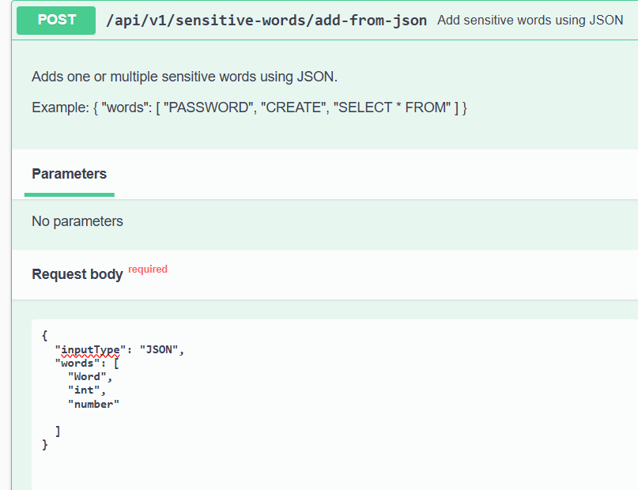
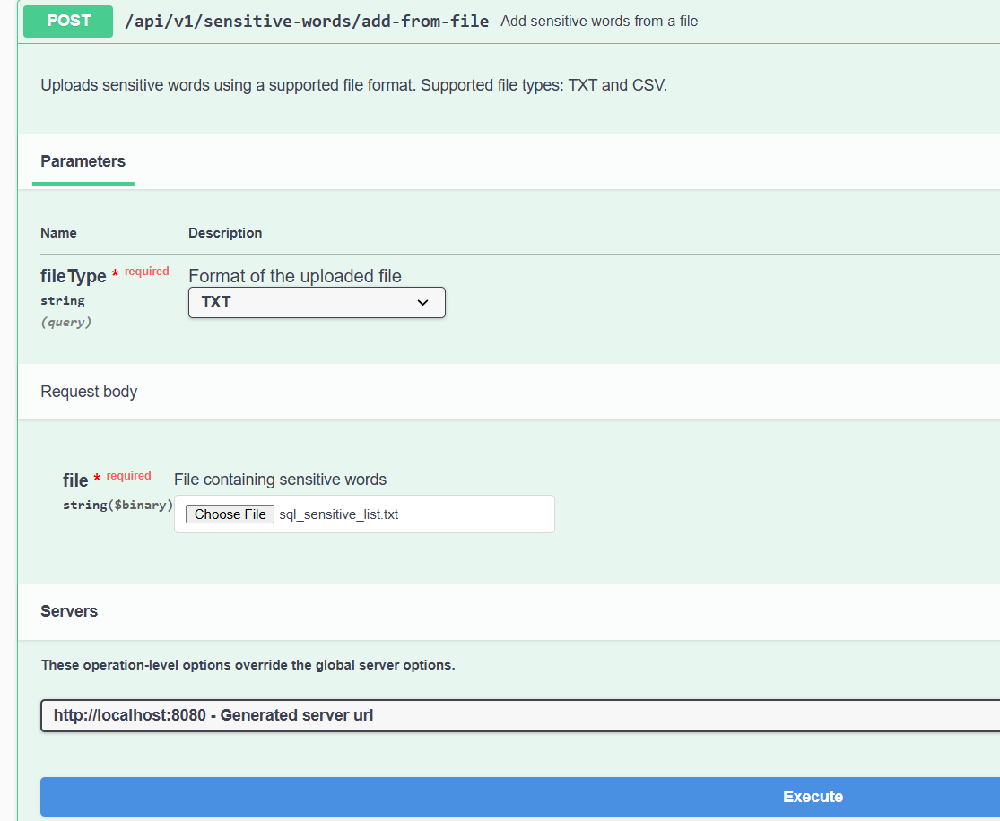
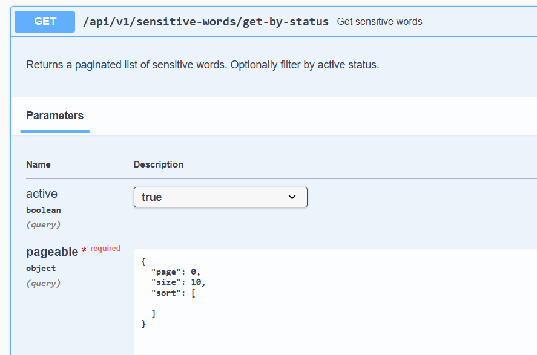
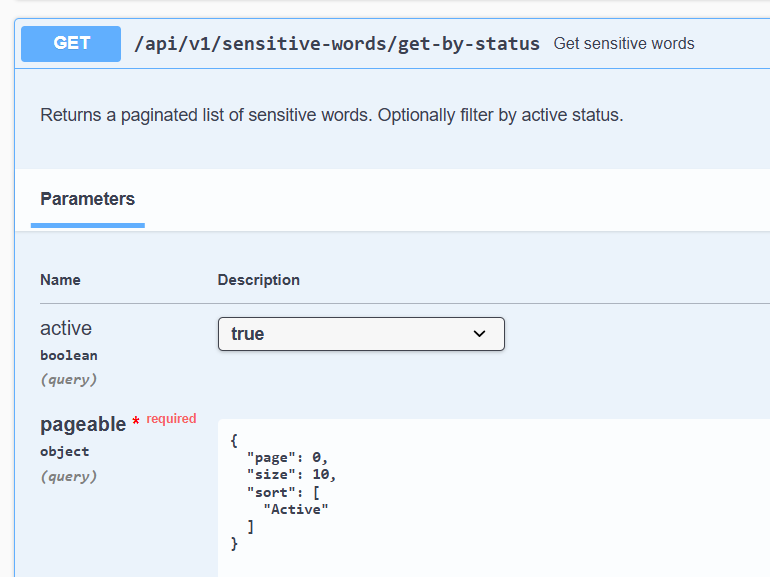

# Sensitive Words Sanitization Service

A Spring Boot REST API for managing sensitive words and sanitizing text by replacing configured sensitive words or phrases with asterisks (`*`).

The service provides:

- RESTful APIs for sensitive-word management
- Text sanitization
- MSSQL persistence
- JSON, TXT and CSV(csv logic was not implemented fully ,it was intended to present basic pattern structure) sensitive-word input
- Case-insensitive matching
- Support for multi-word sensitive phrases
- In-memory compiled sanitization rules
- Automatic cache refresh after configuration changes
- Manual administrative cache refresh
- Audit history
- Sensitive-word usage tracking
- Basic Authentication and role-based access
- Swagger / OpenAPI documentation
- Unit and controller tests
- Production deployment considerations

---

## 1. Technology Stack

| Technology | Usage |
|---|---|
| Java 17 | Application language |
| Spring Boot 4.1.1 | Application framework |
| Spring Web | REST APIs |
| Spring Data JPA | Persistence layer |
| Spring Security | Authentication and authorization |
| Spring Validation | Request validation |
| Microsoft SQL Server | Database |
| Hibernate | ORM |
| Jackson 3 | JSON processing |
| Lombok | Boilerplate reduction |
| SpringDoc OpenAPI | Swagger documentation |
| JUnit 5 | Unit testing |
| Mockito | Mocking |
| MockMvc | Controller testing |
| Maven | Build and dependency management |
| Embedded Tomcat | Application web server |

---

## 2. Application Overview

The application has two primary responsibilities.

### Sensitive Word Management

Authorized administrators can:

- Add sensitive words using JSON
- Upload sensitive words using TXT or CSV files
- Retrieve sensitive words
- Retrieve a specific word or phrase
- Update sensitive words
- Disable sensitive words
- Enable sensitive words
- Refresh the in-memory sensitive-word cache

Sensitive words are persisted in Microsoft SQL Server.

Whenever the sensitive-word configuration changes through the application, the in-memory sanitization rules are refreshed so that subsequent sanitization requests use the latest active configuration.

### Text Sanitization

Clients submit text to the sanitization API.

The service compares the supplied text against the currently active sensitive-word rules and replaces matching words or phrases with asterisks.

Example:

### Request

```json
{
  "text": "select * from the database"
}
```

If the database contains:

```text
SELECT * FROM
```

the response is:

```json
{
  "sanitizedText": "************* the database"
}
```

---

## 3. Architecture

The application follows a layered architecture.

```text
                    Client
                      |
                      v
               +----------------+
               |   Controller   |
               +----------------+
                      |
                      v
               +----------------+
               |    Service     |
               +----------------+
                 |            |
                 v            v
         +-------------+   +------------------+
         | Repository  |   | In-Memory Rules  |
         +-------------+   +------------------+
                |
                v
         +----------------+
         | Microsoft SQL  |
         |     Server     |
         +----------------+
```

Main application packages:

```text
za.co.flash.sensitivewords
|
+-- config
+-- controller
+-- dto
+-- entity
+-- enums
+-- exception
+-- model
+-- repository
+-- service
|   |
|   +-- impl
|   +-- strategy
|
+-- util
```

Responsibilities are separated between the API layer, business layer, persistence layer and sanitization engine.

---

## 4. Database Design

The application uses the following SQL Server schema:

```text
sanitization
```

The main tables are:

```text
sanitization.sensitive_word
sanitization.sensitive_word_audit
sanitization.sensitive_word_usage
```

### sensitive_word

Stores the configured sensitive words and phrases.

Example structure:

```sql
CREATE TABLE sanitization.sensitive_word (
    id BIGINT IDENTITY(1,1) NOT NULL PRIMARY KEY,
    word NVARCHAR(255) NOT NULL,
    active BIT NOT NULL DEFAULT 1,
    created_at DATETIME2 NOT NULL DEFAULT SYSUTCDATETIME(),
    updated_at DATETIME2 NULL,
    version BIGINT NOT NULL DEFAULT 0
);
```

A unique index prevents duplicate configured values:

```sql
CREATE UNIQUE INDEX ux_sensitive_word_word
ON sanitization.sensitive_word(word);
```

### sensitive_word_audit

Stores the history of sensitive-word management operations.

Supported audit actions include:

```text
CREATE
UPDATE
DISABLE
ENABLE
```

The audit record captures information including:

- Sensitive word
- Action
- Old value
- New value
- User who performed the operation
- Date/time

### sensitive_word_usage

Stores usage information for sensitive words.

This allows sanitization usage to be tracked independently from the main sensitive-word configuration.

---

## 5. Sensitive Word Normalization

Before a sensitive word is persisted, it is normalized.

For example:

```text
"  select  "
```

becomes:

```text
SELECT
```

Normalization is performed using:

```java
word.trim().toUpperCase(Locale.ROOT)
```

This provides a consistent canonical representation in the database.

The maximum supported sensitive-word length is:

```text
255 characters
```

---

## 6. Sanitization Rules

Sensitive-word matching is case-insensitive.

For example, a configured rule:

```text
SELECT
```

will match:

```text
SELECT
select
Select
sElEcT
```

### Exact Words

Sensitive words are not matched inside larger words.

For example, if the configured sensitive word is:

```text
DATA
```

then:

```text
DATA is sensitive
```

becomes:

```text
**** is sensitive
```

but:

```text
database
```

remains:

```text
database
```

This prevents unintended partial-word replacements.

### Multi-Word Phrases

Sensitive phrases are treated as complete configured expressions.

For example:

```text
SELECT * FROM
```

matches:

```text
select * from
```

but does not automatically mean that the following are sensitive:

```text
SELECT
FROM
SELECT    * FROM
FROM * SELECT
```

Those expressions must be independently configured if they should also be sanitized.

### Overlapping Rules

Sensitive rules are ordered by length before being applied.

For example, if both of these are configured:

```text
SELECT
SELECT * FROM
```

the longer expression is evaluated first.

This prevents the shorter rule from modifying the input before the longer configured phrase can be matched.

---

## 7. Sanitization Performance

The sanitization endpoint is designed so that it does not query SQL Server for every incoming request.

At application startup:

```text
Application starts
       |
       v
Read active sensitive words from MSSQL
       |
       v
Compile regular expressions
       |
       v
Store rules in application JVM memory
```

The rules are loaded by:

```java
@PostConstruct
public void initialiseWords() {

    refresh();
}
```

The active rules are stored as:

```java
private volatile List<SensitiveWordRule> rules = List.of();
```

Each rule contains:

- The configured sensitive word/phrase
- A precompiled regular expression

The pattern uses case-insensitive matching and regular expression:

```java
Pattern.compile(
        "(?<![\\p{L}\\p{N}_])"
                + Pattern.quote(phrase)
                + "(?![\\p{L}\\p{N}_])",
        Pattern.CASE_INSENSITIVE
)
```

As a result, the `/sanitize` hot path:

- Does not query the database
- Does not compile regular expressions for every request
- Reads rules directly from JVM memory

This reduces database traffic and improves response time.

---

## 8. Cache Management

Microsoft SQL Server remains the persistent source of truth for sensitive-word configuration.

The in-memory rules are an optimized runtime representation of the currently active configuration.

### Application Startup

When the application starts, all active sensitive words are loaded from the database and compiled into in-memory sanitization rules.

```text
Application Startup
        |
        v
MSSQL
        |
        v
Load Active Words
        |
        v
Compile Patterns
        |
        v
JVM Rule Cache
```

### Automatic Cache Refresh

The cache is refreshed whenever a sensitive-word configuration change is successfully performed through the management service.

The following operations trigger a cache refresh:

```text
CREATE
UPDATE
DISABLE
ENABLE
```

For example:

```text
Create Sensitive Word
        |
        v
Persist Word
        |
        v
Create Usage Record
        |
        v
Create Audit Record
        |
        v
Refresh Active Rules
```

Similarly:

```text
Disable Sensitive Word
        |
        v
Set active = false
        |
        v
Create Audit Record
        |
        v
Refresh Active Rules
        |
        v
Disabled Rule Removed From Active Cache
```

If a word is already disabled and another disable request is received, no configuration change occurs and the cache is not unnecessarily refreshed.

The same applies when an already-enabled word receives another enable request.

### Manual Cache Refresh

An administrative API is also provided to manually refresh the cache.

This allows the application to synchronize its in-memory rules with the database if sensitive-word data has been modified directly in SQL Server or if an administrator explicitly wants to reload the current configuration.

---

## 9. Input Strategy

The application supports different mechanisms for adding sensitive words.

The business operation remains the same:

```text
Add Sensitive Words
```

The input mechanism can differ.

The application uses a Strategy Pattern to separate input parsing from the common persistence logic.

```text
SensitiveWordInputService
          |
          v
SensitiveWordInputStrategyResolver
          |
          +----------------------+
          |                      |
          v                      v
       JSON                   FILE
                              |
                         +-----+-----+
                         |           |
                         v           v
                        TXT         CSV
```

The strategy interface is:

```java
public interface SensitiveWordInputStrategy {

    boolean supports(SensitiveWordInputRequest request);

    List<String> extractWords(SensitiveWordInputRequest request);
}
```

This design allows additional input formats to be introduced without changing the main sensitive-word processing logic.

---

## 10. JSON Input

Sensitive words can be added using JSON.

### Endpoint

```http
POST /api/v1/sensitive-words/add-from-json
```

### Request

```json
{
  "words": [
    "PASSWORD",
    "CREATE",
    "SELECT * FROM"
  ]
}
```

### Example Response

```json
{
  "totalReceived": 3,
  "inserted": 3,
  "duplicates": 0,
  "invalid": 0,
  "duplicateWords": [],
  "invalidWords": []
}
```

The service handles:

- Normalization
- Validation
- Duplicates within the request
- Existing database duplicates
- Persistence
- Usage record creation
- Audit record creation

---

## 11. File Input

Sensitive words can also be uploaded using files.

### Endpoint

```http
POST /api/v1/sensitive-words/add-from-file
```

Content type:

```text
multipart/form-data
```

Parameters:

| Parameter | Type | Required | Description |
|---|---|---:|---|
| `file` | MultipartFile | Yes | File containing sensitive words |
| `fileType` | Enum | Yes | `TXT` or `CSV` |

Example:

```text
fileType=TXT
```

The request is converted internally into:

```text
InputType.FILE
FileType.TXT
```

or:

```text
InputType.FILE
FileType.CSV
```

The appropriate strategy is then selected by the strategy resolver.

---

## 12. REST API

Base URL:

```text
http://localhost:8080
```

### Sensitive Word Management

Sensitive-word management endpoints require the `ADMIN` role.

### Add From JSON

```http
POST /api/v1/sensitive-words/add-from-json
```

Example request:

```json
{
  "words": [
    "SELECT",
    "UPDATE",
    "SELECT * FROM"
  ]
}
```

Successful response:

```text
201 Created
```

---

### Add From File

```http
POST /api/v1/sensitive-words/add-from-file
```

Content type:

```text
multipart/form-data
```

Required parameters:

```text
file
fileType
```

Successful response:

```text
201 Created
```

---

### Get Sensitive Words

```http
GET /api/v1/sensitive-words/get-by-status
```

Optional active filter:

```http
GET /api/v1/sensitive-words/get-by-status?active=true
```

Pagination is supported through Spring Data `Pageable`.

For example:
unsorted:

```http
GET /api/v1/sensitive-words/get-by-status?active=true&page=0&size=10
```
sorted


---

### Get Sensitive Word

```http
GET /api/v1/sensitive-words/get-word?word=SELECT
```

---

### Update Sensitive Word

```http
PUT /api/v1/sensitive-words/update-word?word=SELECT
```

A successful update:

1. Updates the database record.
2. Creates an audit record.
3. Refreshes the in-memory sensitive-word rules.
4. Returns the updated sensitive-word record.

---

### Disable Sensitive Word

The application uses a soft-delete approach.

```http
DELETE /api/v1/sensitive-words/disable-word?word=SELECT
```

The database record is retained for auditing purposes.

The record is marked as inactive and the in-memory rules are refreshed.

Successful response:

```text
204 No Content
```

---

### Enable Sensitive Word

```http
PATCH /api/v1/sensitive-words/enable-word?word=SELECT
```

The word is marked as active and the in-memory rules are refreshed.

---

### Refresh Sensitive Word Cache

The application exposes an administrative endpoint for manually reloading the sensitive-word cache.

```http
POST /api/v1/sensitive-words/refresh-cache
```

The endpoint:

1. Reads all active sensitive words from Microsoft SQL Server.
2. Orders configured expressions by length.
3. Compiles the sanitization patterns.
4. Replaces the current in-memory rule list.

Successful response:

```text
200 OK
```

```json
{
  "message": "Sensitive words cache refreshed successfully"
}
```

The endpoint requires the `ADMIN` role.

This endpoint is useful when sensitive-word data has been modified directly in the database or when an administrator explicitly wants to synchronize the application cache with the persisted configuration.

---

## 13. Sanitization API

### Endpoint

```http
POST /api/v1/sanitize
```

### Request

```json
{
  "text": "select * from the database"
}
```

### Response

```json
{
  "sanitizedText": "************* the database"
}
```

The request requires non-blank text.

Example validation:

```java
@NotBlank(message = "Text is required")
private String text;
```

The endpoint uses the in-memory rules and does not query SQL Server for each sanitization request.

---

## 14. Authentication and Authorization

The application uses Spring Security with HTTP Basic Authentication.

Two roles are configured:

```text
ADMIN
USER
```

### ADMIN

Administrators can access sensitive-word management APIs.

```text
/api/v1/sensitive-words/**
```

This includes the manual cache refresh API.

### USER

Users can access the sanitization API.

```text
/api/v1/sanitize
```

The sanitization endpoint can be accessed by:

```text
USER
ADMIN
```

Sensitive-word management requires:

```text
ADMIN
```

Example configuration:

```properties
internal.auth.admin.username=admin
internal.auth.admin.password=Admin123

internal.auth.user.username=user
internal.auth.user.password=User123
```

> The credentials above are suitable only for demonstration/local development. Production credentials should be stored securely using environment variables or a secrets-management solution.

The authenticated username is also captured for audit operations.

Authorization credentials are never intentionally written to application logs.

---

## 15. Swagger / OpenAPI

Swagger documentation is generated using SpringDoc OpenAPI.

After starting the application, open:

```text
http://localhost:8080/swagger-ui/index.html
```

OpenAPI JSON documentation is available at:

```text
http://localhost:8080/v3/api-docs
```

The API documentation includes:

- Endpoint descriptions
- HTTP methods
- Request parameters
- Request bodies
- Response types
- Response status codes

---

## 16. Application Configuration

Example local SQL Server configuration:

```properties
spring.datasource.url=jdbc:sqlserver://localhost:1433;databaseName=sanitization_db;encrypt=true;trustServerCertificate=true
spring.datasource.username=sanitization_app
spring.datasource.password=<password>
spring.datasource.driver-class-name=com.microsoft.sqlserver.jdbc.SQLServerDriver

spring.jpa.hibernate.ddl-auto=validate
spring.jpa.properties.hibernate.default_schema=sanitization
```

`ddl-auto=validate` is used so that Hibernate validates entity mappings without modifying the production database schema.

---

## 17. Running the Application Locally

### Prerequisites

Install:

- Java 17
- Maven
- Microsoft SQL Server
- Git

Verify Java:

```bash
java -version
```

Verify Maven:

```bash
mvn -version
```

### Clone Repository

```bash
git clone <repository-url>
cd <repository-directory>
```

### Configure Database

Create the SQL Server database:

```sql
CREATE DATABASE sanitization_db;
```

Create/configure the required schema and tables.

Update the application's database configuration with the appropriate SQL Server credentials.

### Build

Using Maven Wrapper:

```bash
./mvnw clean package
```

On Windows:

```bash
mvnw.cmd clean package
```

Alternatively:

```bash
mvn clean package
```

### Run From IntelliJ IDEA

The project can be imported into IntelliJ IDEA as a Maven project.

Run the Spring Boot application main class directly from IntelliJ IDEA.

IntelliJ launches the Spring Boot application and Spring Boot starts its embedded Tomcat server.

No separate Tomcat installation or configuration is required.

### Run Using Maven

```bash
./mvnw spring-boot:run
```

or:

```bash
mvn spring-boot:run
```

### Run Packaged Application

Build the executable JAR:

```bash
mvn clean package
```

Then run:

```bash
java -jar target/<application-jar>.jar
```

The application will start on:

```text
http://localhost:8080
```

---

## 18. Running Tests

Run all tests:

```bash
./mvnw test
```

or:

```bash
mvn test
```

The test suite covers the main application layers.

### Sanitization Tests

Tests include:

- Case-insensitive matching
- Exact sensitive phrases
- Multi-word phrases
- Partial-word protection
- Multiple sensitive words
- No configured rules
- Different phrase spacing
- Different phrase ordering

### Cache Tests

Tests include:

- Loading active sensitive words
- Compiling patterns
- Case-insensitive matching
- Longest-rule-first ordering
- Preventing matching inside larger words

### Sensitive Word Service Tests

Tests include:

- Creating sensitive words
- Duplicate detection
- Normalization
- Validation
- Finding words
- Pagination
- Enabling words
- Disabling words
- Audit interaction
- Usage record creation
- Cache refresh after creating a word
- Cache refresh after updating a word
- Cache refresh after enabling a word
- Cache refresh after disabling a word
- Avoiding unnecessary cache refresh when the state has not changed

### Input Processing Tests

Tests include:

- JSON/file strategy processing
- Request duplicates
- Database duplicates
- Invalid values
- Maximum word length
- Usage creation
- Audit creation
- Authenticated username capture

### Audit Tests

Tests verify:

- CREATE audit
- UPDATE audit
- DISABLE audit
- ENABLE audit

### Controller Tests

MockMvc is used to verify:

- HTTP status codes
- Request mapping
- JSON serialization/deserialization
- Validation
- Multipart file upload
- Controller/service interaction

---

## 19. Logging

SLF4J is used for application logging.

Examples of logged operations include:

- Cache initialization
- Cache refresh
- Sensitive-word creation
- Sensitive-word lookup
- Enable/disable operations
- Input processing
- Duplicate detection
- Invalid input
- Audit creation
- Usage creation

The sanitization service deliberately does **not** log the incoming text because it may contain sensitive information.

Authentication headers and passwords should also never be logged.

---

## 20. Error Handling

Business validation errors are represented using application exceptions such as:

```text
SensitiveWordException
```

Examples include:

```text
Sensitive word is required
Sensitive word cannot exceed 255 characters
Sensitive word already exists
Sensitive word not found
```

Request DTOs also use Jakarta Bean Validation where appropriate.

For example:

```java
@NotBlank(message = "Text is required")
private String text;
```

The API returns appropriate HTTP responses for invalid requests and business failures.

---

## 21. Performance Considerations

Several design decisions were made specifically for performance and scalability.

### In-Memory Sanitization Rules

Active sensitive words are loaded into JVM memory instead of being retrieved from SQL Server for every sanitization request.

This removes a database round trip from the main sanitization path.

### Precompiled Patterns

Regular-expression patterns are compiled when the rules are loaded rather than for every incoming request.

This means the normal sanitization path performs matching using already-compiled patterns.

### Cache Refresh Only When Required

Management operations refresh the cache after a configuration change.

However, unnecessary refreshes are avoided.

For example, requesting that an already-disabled word be disabled again does not cause another database write, audit operation, or cache refresh.

The same principle applies to already-enabled words.

### Bulk Database Operations

Sensitive-word imports use bulk operations:

```java
saveAll(...)
```

for:

- Sensitive words
- Usage records
- Audit records

This avoids individually persisting every imported record.

### Duplicate Detection

Incoming words are normalized and stored temporarily in a:

```java
LinkedHashSet
```

This removes request-level duplicates before persistence.

Existing values are queried before inserts to reduce unnecessary database operations.

### Pagination

Sensitive-word retrieval uses Spring Data pagination rather than returning the entire table.

### Atomic Usage Updates

Usage updates can be performed directly through the repository instead of loading and rewriting the complete entity.

---

## 22. Concurrency

The active rule collection is held using:

```java
private volatile List<SensitiveWordRule> rules = List.of();
```

The rule list is replaced as a complete reference when refreshed.

The refresh process first constructs the new rule list and then replaces the current reference.

This allows sanitization requests to continue reading the existing immutable rule list while a newer rule list is being prepared.

Once the new list is assigned, the `volatile` reference ensures other application threads can observe the updated rule-list reference.

This keeps the high-frequency sanitization read path lightweight.

The database entity also uses optimistic locking through a version column to protect against conflicting updates.

---

## 23. Audit Design

Sensitive-word configuration changes are audited separately from the primary sensitive-word table.

This keeps operational data separate from historical data.

Audit records identify:

```text
What changed
Previous value
New value
Who changed it
When it changed
```

Soft deletion is used for sensitive words so historical records and relationships can be retained.

Disabling a word therefore changes its active state rather than physically removing the configuration and its associated history.

---

## 24. Application Runtime

The application currently runs as a standalone Spring Boot application using Java 17 and Spring Boot's embedded Tomcat server.

```text
Java 17
    |
    v
Spring Boot
    |
    v
Embedded Tomcat
    |
    v
Sensitive Words REST API
```

No external Tomcat installation is required.

When started from IntelliJ IDEA, IntelliJ launches the Spring Boot application and Spring Boot starts the embedded Tomcat server.

The application can also run independently of IntelliJ using Maven:

```bash
mvn spring-boot:run
```

or as an executable JAR:

```bash
mvn clean package
java -jar target/<application-jar>.jar
```

The application currently does not include Docker configuration.

Containerization could be introduced later if required by the target deployment environment.

---

## 25. Production Deployment

The current implementation is packaged as a standard executable Spring Boot application.

A production deployment could use the following architecture:

```text
                  Internet / Client
                         |
                         v
                  +---------------+
                  | Load Balancer |
                  | / API Gateway |
                  +---------------+
                         |
                         v
               +---------------------+
               | Spring Boot Service |
               | Java 17             |
               | Embedded Tomcat     |
               +---------------------+
                    |             |
                    |             |
                    v             v
           +--------------+   +----------+
           | JVM Rule     |   | MSSQL    |
           | Cache        |   | Database |
           +--------------+   +----------+
```

A typical production deployment would:

1. Build the application using Maven.
2. Execute automated tests.
3. Package the executable Spring Boot JAR.
4. Deploy the application to a Java 17 runtime environment.
5. Supply database and authentication credentials through secure environment/secrets configuration.
6. Expose the application through a load balancer or API gateway.
7. Enable centralized logging and monitoring.
8. Configure application health checks.
9. Deploy multiple application instances when higher availability is required.

The executable Spring Boot JAR makes the application portable between environments without requiring a separately managed Tomcat server.

Containerization could also be introduced later if the target infrastructure requires Docker, Kubernetes, ECS, or another container platform.

---

## 26. Multi-Instance Consideration

The current in-memory rule cache belongs to a single JVM instance.

For a single application instance this is straightforward:

```text
Database
   |
   v
Application JVM
   |
   v
In-Memory Rules
```

Management operations can update the database and immediately refresh the local application's rules.

With multiple application instances:

```text
                 MSSQL
                   |
           +-------+-------+
           |               |
           v               v
       Instance A      Instance B
       JVM Cache       JVM Cache
```

each instance has its own local copy of the rules.

For example, if a configuration change is processed by Instance A:

```text
                  MSSQL
                    ^
                    |
              Configuration
                 Update
                    |
               Instance A
                    |
                    v
             Refresh Cache A


               Instance B
                    |
                    v
             Existing Cache B
```

Instance B would not automatically know that Instance A refreshed its local JVM memory.

For a larger production deployment, cache synchronization could be implemented using:

- Redis
- Publish/subscribe
- Application events combined with messaging
- Message queues
- Scheduled reconciliation
- Distributed caching

For example:

```text
Admin Update
     |
     v
Instance A
     |
     +------> MSSQL
     |
     +------> Cache Change Event
                    |
              +-----+-----+
              |           |
              v           v
         Instance A   Instance B
         Refresh      Refresh
```

This would allow configuration changes made through one application instance to be propagated to all other instances.

The current manual cache refresh API also provides an operational mechanism for reloading an individual application's rules from the database.

---

## 27. Additional Enhancements

The following enhancements could be introduced for a larger production implementation.

### Distributed Cache Synchronization

Synchronize rule changes between multiple application instances using Redis or event-driven invalidation.


### External Identity Provider

Replace local Basic Authentication with enterprise authentication such as:

- OAuth 2.0
- OpenID Connect
- Microsoft Entra ID
- Keycloak

### Metrics and Monitoring

Add Spring Boot Actuator and metrics for:

- Request counts
- Sanitization latency
- Cache size
- Cache refreshes
- Error rates
- Database connection health

Metrics could be exported to platforms such as Prometheus/Grafana or a cloud monitoring service.

### Integration Testing

Use Testcontainers with Microsoft SQL Server to test repository behavior against a real SQL Server instance during automated builds.

### CI/CD

A production pipeline could automatically:

```text
Checkout
   |
   v
Compile
   |
   v
Unit Tests
   |
   v
Integration Tests
   |
   v
Package
   |
   v
Publish Artifact
   |
   v
Deploy
```

If the target environment uses containers, a Docker image build and container registry stage could be added to the pipeline.

---

## 28. Design Decisions

### Why SQL Server as the Source of Truth?

Sensitive-word configuration needs to survive application restarts and provide consistent persisted configuration.

SQL Server therefore remains the authoritative data source.

The in-memory cache is deliberately treated as a runtime optimization rather than the persistent source of truth.

### Why Keep Rules in JVM Memory?

Sanitization is expected to occur much more frequently than configuration changes.

Querying SQL Server for every sanitization request would introduce unnecessary latency and database load.

Loading active rules into memory makes the common operation significantly cheaper.

The difference in request flow is:

```text
Without Cache

Request
   |
   v
SQL Server
   |
   v
Load Rules
   |
   v
Sanitize
   |
   v
Response
```

compared with:

```text
Current Design

Request
   |
   v
JVM Rules
   |
   v
Sanitize
   |
   v
Response
```

### Why Refresh After Configuration Changes?

The database is the source of truth, but the sanitization endpoint operates against JVM memory.

A configuration change therefore needs to be reflected in the runtime rule set.

For this reason:

```text
CREATE
UPDATE
DISABLE
ENABLE
```

refresh the active rule cache after a successful configuration change.

This keeps subsequent sanitization requests synchronized with the latest application-managed configuration.

### Why Provide a Manual Cache Refresh API?

Application-managed changes automatically refresh the cache.

However, the database could potentially be modified through an external administrative process or directly during support/testing.

The manual refresh API provides an explicit operational mechanism for synchronizing the local JVM rules with the current database state.

### Why Precompile Regex Patterns?

Compiling a regex for every rule on every request creates unnecessary CPU work.

The patterns are therefore compiled when rules are loaded.

The high-frequency sanitization operation then reuses those compiled patterns.

### Why Use Exact Configured Phrases?

The application does not attempt to infer what the administrator intended.

If:

```text
SELECT * FROM
```

is configured, that exact phrase is sensitive.

It does not automatically make:

```text
SELECT
FROM
```

sensitive.

This keeps configuration explicit and predictable.

### Why Use Soft Delete?

Sensitive words may have associated:

- Audit records
- Usage records
- Historical information

Disabling rather than physically deleting the record preserves those relationships.

It also allows a previously configured rule to be enabled again without recreating its configuration.

### Why Strategy Pattern for Input?

JSON, TXT and CSV (was not implemented fully, just a basic structure) are input mechanisms, not different business operations.

Each strategy is responsible for extracting words from its format.

After extraction, all formats use the same:

- Normalization
- Validation
- Duplicate detection
- Persistence
- Usage creation
- Audit creation

This avoids duplicating business logic.

---

## 29. Security Considerations

The application includes several security-related considerations:

- Management APIs are restricted to administrators.
- The cache refresh API is restricted to administrators.
- Authentication is handled by Spring Security.
- Passwords are not written to logs.
- Authorization headers are not written to logs.
- Sanitization input is not logged.
- SQL access is handled through parameterized JPA queries.
- Request validation is performed before processing.
- Database credentials should be externalized for production deployment.
- Local Basic Authentication credentials are intended for demonstration purposes only.

---

## 30. Project Structure

```text
src
|
+-- main
|   |
|   +-- java
|   |   |
|   |   +-- za/co/flash/sensitivewords
|   |       |
|   |       +-- config
|   |       +-- controller
|   |       +-- dto
|   |       +-- entity
|   |       +-- enums
|   |       +-- exception
|   |       +-- model
|   |       +-- repository
|   |       +-- service
|   |       |   |
|   |       |   +-- impl
|   |       |   +-- strategy
|   |       |
|   |       +-- util
|   |
|   +-- resources
|       |
|       +-- application.properties
|
+-- test
    |
    +-- java
        |
        +-- za/co/flash/sensitivewords
            |
            +-- controller
            |   |
            |   +-- SanitizationControllerTest.java
            |   +-- SensitiveWordControllerTest.java
            |
            +-- service
                |
                +-- impl
                    |
                    +-- SanitizationServiceImplTest.java
                    +-- SensitiveWordAuditServiceImplTest.java
                    +-- SensitiveWordCacheServiceImplTest.java
                    +-- SensitiveWordInputServiceImplTest.java
                    +-- SensitiveWordServiceImplTest.java
                    +-- SensitiveWordUsageServiceImplTest.java
```

---

## 31. Build Verification

Before submitting or deploying the project, run:

```bash
mvn clean test
```

All tests should complete successfully.

Then package the application:

```bash
mvn clean package
```

A successful build should complete with:

```text
BUILD SUCCESS
```

The generated executable JAR can then be found in:

```text
target/
```

and started using:

```bash
java -jar target/<application-jar>.jar
```

---

## 32. End-to-End Processing Flow

The complete management and sanitization flow can be represented as:

```text
                    ADMIN
                      |
                      v
             Management REST API
                      |
                      v
               Business Service
                      |
          +-----------+-----------+
          |                       |
          v                       v
      MSSQL DB                  Audit
          |
          v
     Cache Refresh
          |
          v
  Compiled JVM Rules
          ^
          |
          |
      Sanitization
          |
          ^
          |
        USER
```

For the high-frequency sanitization path:

```text
USER
 |
 v
POST /api/v1/sanitize
 |
 v
SanitizationController
 |
 v
SanitizationService
 |
 v
Compiled JVM Rules
 |
 v
Pattern Matching
 |
 v
Sanitized Response
```

No SQL Server query is required on this path.

For a management operation:

```text
ADMIN
 |
 v
Management API
 |
 v
Validate / Normalize
 |
 v
MSSQL
 |
 +----> Usage / Audit
 |
 v
Refresh Cache
 |
 v
Latest Active Rules
```

This separation allows configuration operations to remain durable and auditable while keeping the more frequently executed sanitization operation lightweight.

---

## 33. Summary

The Sensitive Words Sanitization Service provides a maintainable and extensible solution for managing and applying sensitive-word rules.

The implementation focuses on:

- Clear separation of responsibilities
- RESTful API design
- MSSQL persistence
- Fast in-memory sanitization
- Precompiled matching rules
- Exact and case-insensitive matching
- Multi-word phrase support
- Protection against unintended partial-word matches
- Extensible JSON, TXT and CSV input processing
- Strategy Pattern
- Auditing
- Usage tracking
- Soft deletion
- Authentication and role-based authorization
- Automatic cache refresh
- Manual administrative cache refresh
- Pagination
- Input validation
- Automated unit and controller testing
- Concurrency considerations
- Production deployment considerations

The database remains the persistent source of truth, while precompiled in-memory rules keep the high-volume sanitization path independent of database calls.

The resulting runtime design keeps the common operation intentionally simple:

```text
Request
   |
   v
In-Memory Compiled Rules
   |
   v
Sanitization
   |
   v
Response
```

while configuration changes follow the durable management path:

```text
Configuration Change
        |
        v
Microsoft SQL Server
        |
        v
Audit / Usage
        |
        v
Cache Refresh
        |
        v
Updated Runtime Rules
```

This provides a balance between persistence, performance, auditability, maintainability and future scalability.